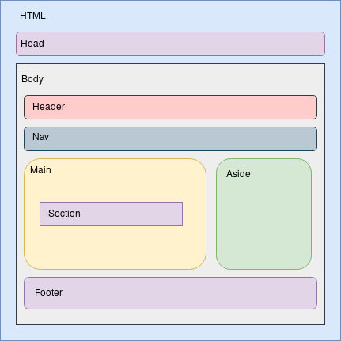

# Hojas de estilo del sitio web

Hay un total de 3 hojas de estilo CSS que definen el aspecto del sitio web. Aquí se enumeran:

- **estilo.css**: define el aspecto de los elementos del sitio web, es decir, las fuentes, tamaños, paddings y márgenes, colores y los comportamientos.
- **layout-index.css**: define el layout o estructura del documento **index.html**, se tuvo que crear aparte ya que el índice cuénta con un aside que el resto de los documentos no comparte.
- **layout-other.css**: define el layout of estructura del resto de los documentos HTML del sitio web.

# Aspecto general

El sitio web cuenta con los siguiente elementos:

- **Título**: El título *Los Soprano* que se muestra en cada documento arriba en el centro.
- **Menú**: El menú del sitio web, por el que se accede al resto de documentos.
- **Contenido principal**: Contenido de la página actual del sitio, con título propio y texto, multimedia, o enlaces a otras páginas.
- **Botones de validación**: Abajo a la izquierda se encuentran los botones que indican que el sitio contiene HTML5 y CSS válido.
- **Colores**: Los colores del sitio web son bastante simples, fondo gris muy oscuro, título principal gris claro, títulos secundarios dorados, elementos del menú azules y enlaces de la barra lateral (si existe) dorados.

# Disposición de los elementos

Tenemos dos disposiciones principales:

## Index

Para el documento **index.html** se ha definido una estructura diferente al resto de los documentos, ya que cuenta con un *aside* que el resto no contiene.

Su estructura es la siguiente (Ver figura 1):

- **Cabeza del documento**: Contiene diversos metadatos que dan información sobre el index, como el *charset*, el autor, una descripción y la hoja de estilos enlazada.
- **Cuerpo del documento**.
    - **Cabecera**: en este caso muestra un título con el texto *Los Soprano*.
    - **Nav**: menú del sitio web con enlaces a los otros documentos HTML5.
    - **Main**: contiene una sección con el contenido principal del index.
    - **Aside**: contiene enlaces a otros sitios web que hablan de la serie *Los Soprano*.
    - **Footer**: muestra dos logos que enlazan a los validadores HTML y CSS del W3C.

{height=350px}

## Resto de documentos

El resto de documentos comparten la misma estructura semántica, que es la siguiente (Ver figura 2):

- **Cabeza del documento**: Contiene diversos metadatos que dan información sobre el documento en cuestión, como el *charset*, el autor, una descripción y la hoja de estilos enlazada.
- **Cuerpo del documento**.
    - **Cabecera**: en este caso muestra un título con el texto que identifica al documento.
    - **Nav**: menú del sitio web con enlaces a los otros documentos HTML5.
    - **Main**: contiene una o varias secciones con el contenido principal del documento.
    - **Footer**: muestra dos logos que enlazan a los validadores HTML y CSS del W3C. 

{height=350px}

# Cambios del HTML respecto a la anterior práctica

No hay cambios entre el HTML de esta práctica y el de la anterior, por lo que se asume que todos los documentos son válidos.

# Resultado de las herramientas de validación y verificación de accesibilidad y adaptabilidad

## Validador de CSS del W3c

Como podemos observar en las figuras 3-6, el validador de CSS del W3C no muestra ningún error. Sin embargo en la hoja de estilos *estilo.css* podemos observar advertencias sobre la definición de los colores, que según el guión de la práctica no son necesarios de corregir.

{height=350px}

{height=350px}

{height=350px}

{height=350px}

## Herramienta TAW

La herramienta TAW muestra varias advertencias en cada documento HTML (Ver figuras 7-15). Estas advertencias están relacionadas con el contenido del documento y son difíciles de detectar por una máquina, por lo que TAW recomienda revisarlas manualmente para observar si se cumplen o no.

Estas advertencias son:

- **Contenido no textual**: se refiere a si los elementos no textuales del documento HTML tienen un texto alternativo explicando el contenido mostrado.
- **Páginas tituladas**: se refiere a si los documentos tienen algún título que defina su tema o propósito.
- **Encabezados y etiquetas**: se refiere a si los encabezados o etiquetas del documento describen el tema o propósito.
- **Información y relaciones**: se refiere a si la información, estructura o relaciones pueden ser determinadas de forma programática o están disponibles de forma textual.

{height=350px}

{height=350px}

{height=350px}

{height=350px}

{height=350px}

{height=350px}

{height=350px}

{height=350px}

{height=350px}

## Herramienta Google Mobile Friendly

Hemos corregido todos los problemas encontrados en la anterior práctica debido al css, por lo que ahora Google Mobile-Friendly concluye que todos los documentos del sitio web tienen adaptabilidad para dispositivos móviles (Ver figuras 16-24).

{height=350px}

{height=350px}

{height=350px}

{height=350px}

{height=350px}

{height=350px}

{height=350px}

{height=350px}

{height=350px}

