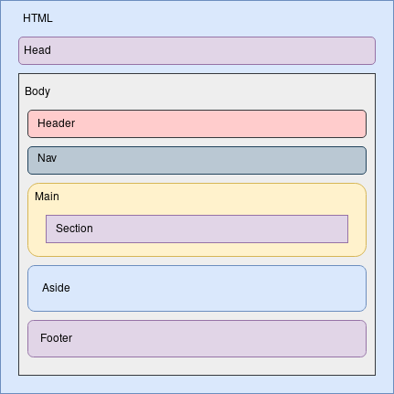
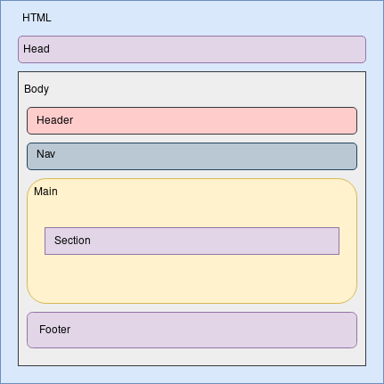

# Estructura de los archivos que componen el sitio web

El sitio web está compuesto por los siguientes archivos:

## Documentos HTML5

Hay un total de 9 documentos HTML5 que componen el sitio web. Aquí se enumeran:

- **index.html**: Es el documento principal del sitio. Muestra una introducción a la serie *Los Soprano* y una serie de enlaces sobre la misma a otros sitios web.
- **apertura.html**: habla sobre el *opening* o secuencia de apertura de la serie, mostrándolo además en forma de vídeo.
- **argumento.html**: explica la trama de *Los Soprano*.
- **concepcion.html**: cuenta la historia de cómo David Chase (el autor de la serie) planteó y llevó su obra a la televisión de la mano de HBO.
- **escenarios_localizaciones.html**: habla sobre la localización real de los escenarios más icónicos de la serie y la relación de los productores con los dueños de alguno de los escenarios.
- **personajes_reparto.html**: describe los personajes de la serie y los relaciona con sus actores.
- **premios.html**: enumera los premios obtenidos por *Los Soprano*.
- **temas.html**: explica brevemente los temas que desarrolla la serie y los compara con otras obras televisivas o cinematográficas.
- **temporadas.html**: muestra una tabla con información sobre las temporadas de *Los Soprano*.

## Documento CSS

El sitio web cuenta con una hoja de estilos CSS **estilo.css** proporcionada por los profesores de la asignatura.

# Estructura semántica de los documentos HTML5 del sitio web

Hay dos estructuras semánticas diferentes en el sitio web.

## Index

Para el documento **index.html** se ha definido una estructura diferente al resto de los documentos, ya que cuenta con un *aside* que el resto no contiene.

Su estructura es la siguiente (Ver figura 1):

- **Cabeza del documento**: Contiene diversos metadatos que dan información sobre el index, como el *charset*, el autor, una descripción y la hoja de estilos enlazada.
- **Cuerpo del documento**.
    - **Cabecera**: en este caso muestra un título con el texto *Los Soprano*.
    - **Nav**: menú del sitio web con enlaces a los otros documentos HTML5.
    - **Main**: contiene una sección con el contenido principal del index.
    - **Aside**: contiene enlaces a otros sitios web que hablan de la serie *Los Soprano*.
    - **Footer**: muestra dos logos que enlazan a los validadores HTML y CSS del W3C.

## Resto de documentos

El resto de documentos comparten la misma estructura semántica, que es la siguiente (Ver figura 2):

- **Cabeza del documento**: Contiene diversos metadatos que dan información sobre el documento en cuestión, como el *charset*, el autor, una descripción y la hoja de estilos enlazada.
- **Cuerpo del documento**.
    - **Cabecera**: en este caso muestra un título con el texto que identifica al documento.
    - **Nav**: menú del sitio web con enlaces a los otros documentos HTML5.
    - **Main**: contiene una o varias secciones con el contenido principal del documento.
    - **Footer**: muestra dos logos que enlazan a los validadores HTML y CSS del W3C. 

# Resultado de las herramientas de validación y verificación de accesibilidad y adaptabilidad

## Validador de HTML5 del W3C

Como podemos observar en las siguientes imágenes, el validador de HTML5 del W3C no muestra ningún error ni advertencia.

