# Estructura de los archivos que componen el sitio web

El sitio web está compuesto por los siguientes archivos:

## Documentos HTML5

Hay un total de 9 documentos HTML5 que componen el sitio web. Aquí se enumeran:

- **index.html**: Es el documento principal del sitio. Muestra una introducción a la serie *Los Soprano* y una serie de enlaces sobre la misma a otros sitios web.
- **apertura.html**: habla sobre el *opening* o secuencia de apertura de la serie, mostrándolo además en forma de vídeo.
- **argumento.html**: explica la trama de *Los Soprano*.
- **concepcion.html**: cuenta la historia de cómo David Chase (el autor de la serie) planteó y llevó su obra a la televisión de la mano de HBO.
- **escenarios_localizaciones.html**: habla sobre la localización real de los escenarios más icónicos de la serie y la relación de los productores con los dueños de alguno de los escenarios.
- **personajes_reparto.html**: describe los personajes de la serie y los relaciona con sus actores.
- **premios.html**: enumera los premios obtenidos por *Los Soprano*.
- **temas.html**: explica brevemente los temas que desarrolla la serie y los compara con otras obras televisivas o cinematográficas.
- **temporadas.html**: muestra una tabla con información sobre las temporadas de *Los Soprano*.

## Documento CSS

El sitio web cuenta con una hoja de estilos CSS **estilo.css** proporcionada por los profesores de la asignatura.

# Estructura semántica de los documentos HTML5 del sitio web

Hay dos estructuras semánticas diferentes en el sitio web.

## Index

Para el documento **index.html** se ha definido una estructura diferente al resto de los documentos, ya que cuenta con un *aside* que el resto no contiene.

Su estructura es la siguiente (Ver figura 1):

- **Cabeza del documento**: Contiene diversos metadatos que dan información sobre el index, como el *charset*, el autor, una descripción y la hoja de estilos enlazada.
- **Cuerpo del documento**.
    - **Cabecera**: en este caso muestra un título con el texto *Los Soprano*.
    - **Nav**: menú del sitio web con enlaces a los otros documentos HTML5.
    - **Main**: contiene una sección con el contenido principal del index.
    - **Aside**: contiene enlaces a otros sitios web que hablan de la serie *Los Soprano*.
    - **Footer**: muestra dos logos que enlazan a los validadores HTML y CSS del W3C.

{height=350px}

## Resto de documentos

El resto de documentos comparten la misma estructura semántica, que es la siguiente (Ver figura 2):

- **Cabeza del documento**: Contiene diversos metadatos que dan información sobre el documento en cuestión, como el *charset*, el autor, una descripción y la hoja de estilos enlazada.
- **Cuerpo del documento**.
    - **Cabecera**: en este caso muestra un título con el texto que identifica al documento.
    - **Nav**: menú del sitio web con enlaces a los otros documentos HTML5.
    - **Main**: contiene una o varias secciones con el contenido principal del documento.
    - **Footer**: muestra dos logos que enlazan a los validadores HTML y CSS del W3C. 

{height=350px}

# Resultado de las herramientas de validación y verificación de accesibilidad y adaptabilidad

## Validador de HTML5 del W3C

Como podemos observar en las figuras 3-11, el validador de HTML5 del W3C no muestra ningún error ni advertencia.

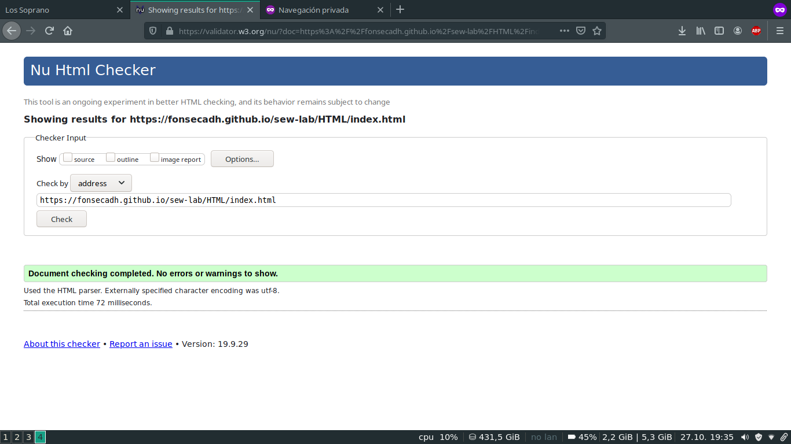{height=350px}

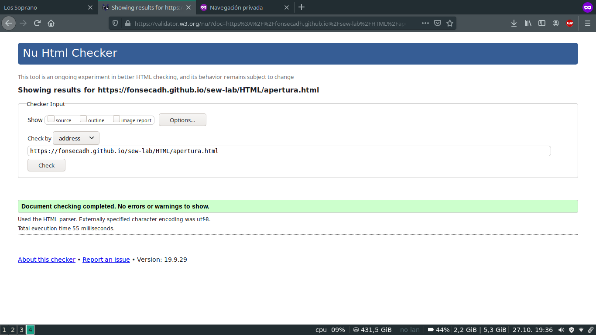{height=350px}

{height=350px}

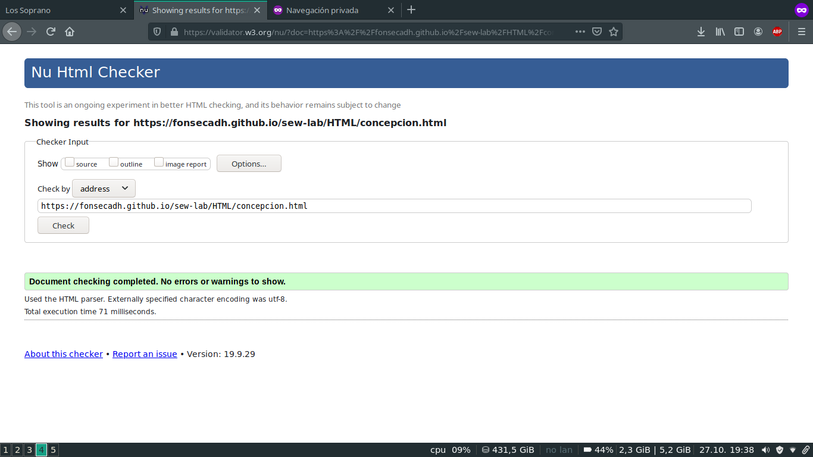{height=350px}

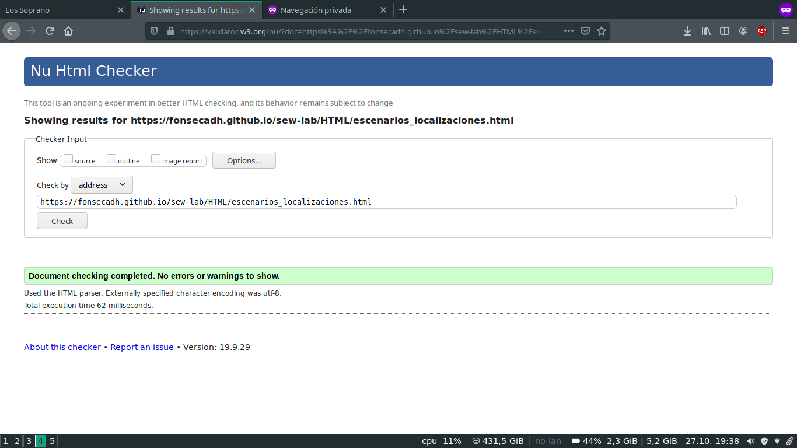{height=350px}

{height=350px}

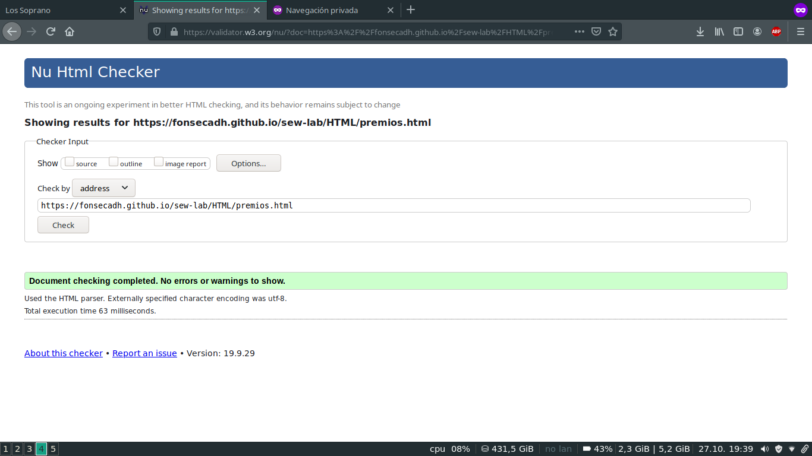{height=350px}

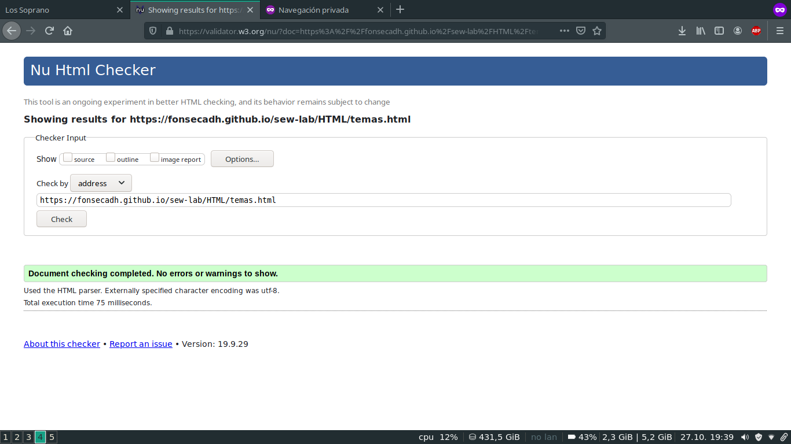{height=350px}

{height=350px}

## Herramienta TAW

La herramienta TAW muestra varias advertencias en cada documento HTML (Ver figuras 12-20). Estas advertencias están relacionadas con el contenido del documento y son difíciles de detectar por una máquina, por lo que TAW recomienda revisarlas manualmente para observar si se cumplen o no.

Estas advertencias son:

- **Contenido no textual**: se refiere a si los elementos no textuales del documento HTML tienen un texto alternativo explicando el contenido mostrado.
- **Páginas tituladas**: se refiere a si los documentos tienen algún título que defina su tema o propósito.
- **Encabezados y etiquetas**: se refiere a si los encabezados o etiquetas del documento describen el tema o propósito.
- **Información y relaciones**: se refiere a si la información, estructura o relaciones pueden ser determinadas de forma programática o están disponibles de forma textual.

{height=350px}

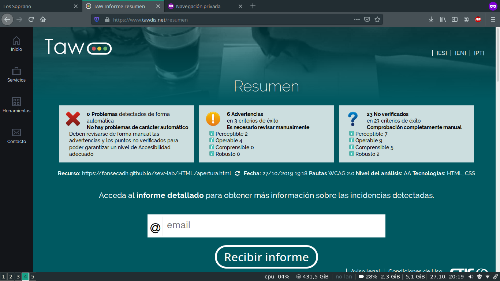{height=350px}

{height=350px}

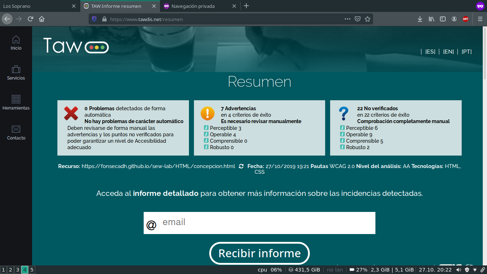{height=350px}

{height=350px}

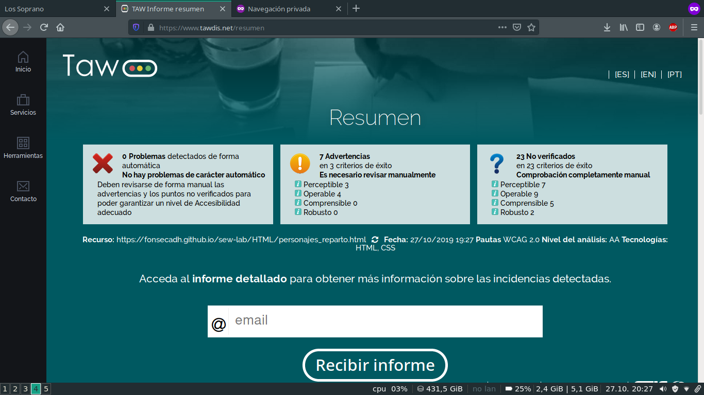{height=350px}

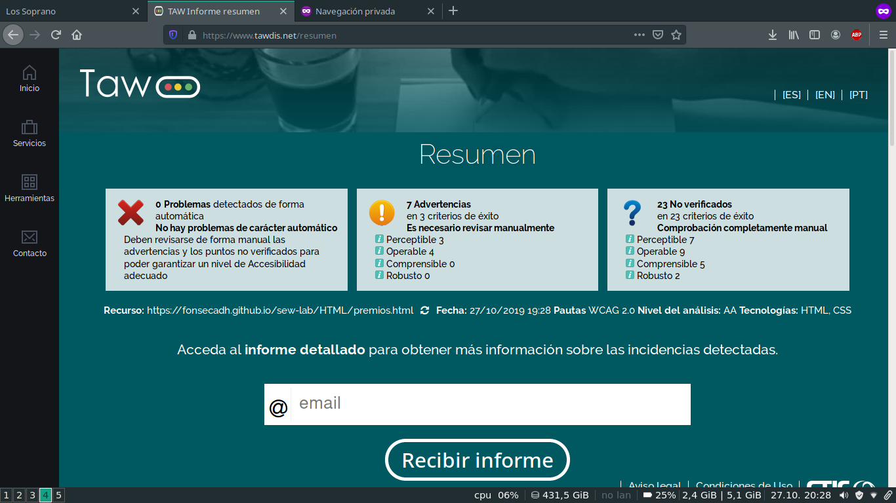{height=350px}

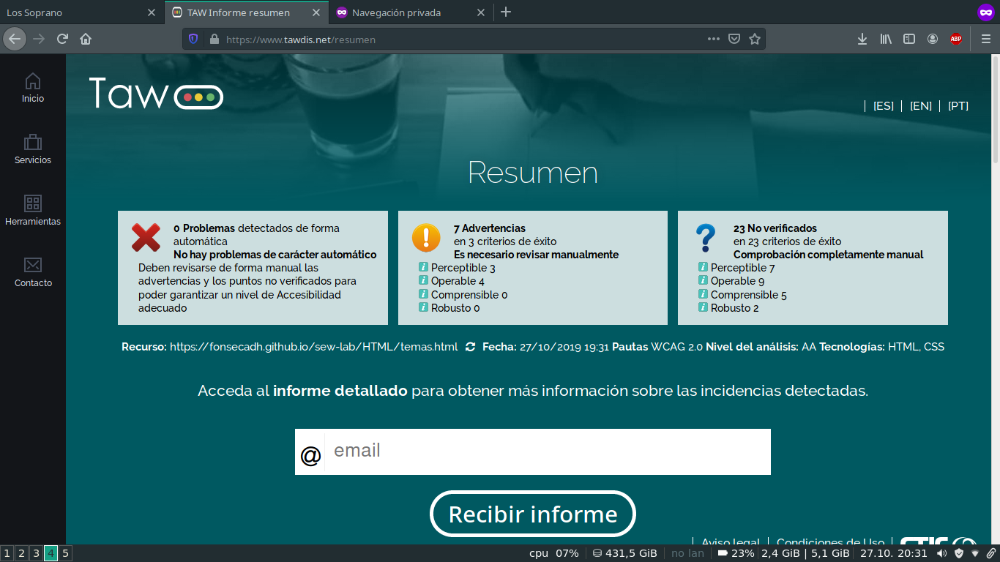{height=350px}

{height=350px}

## Herramienta Google Mobile Friendly

Debido a que el sitio web tiene contenido principalmente textual y una hoja de estilos bastante básica, *Google Mobile-Friendly* concluye que la mayoría de las páginas son accessibles para dispositivos móviles. Sin embargo, los documentos *escenarios_localizaciones.html* y *temporadas.html* no son accesibles ya que hay problemas con la hoja de estilos. 

En el caso de *escenarios_localizaciones.html* el problema viene dado por una imagen mostrada cuyo tamaño es superior al resto de la página, lo que provoca que no se vea adecuadamente. Esto se arreglaría modificando la hoja de estilos css para corregir el tamaño de dicha imagen en relación al resto de la página.

En el otro caso, el de *temporadas.html*, el error viene dado por el tamaño de letra de las columnas de la tabla mostrada en ese documento. Como en el anterior, el error se solventaría modificando el tamaño de letra de las columnas de dicha tabla.

 (Ver figuras 21-29).

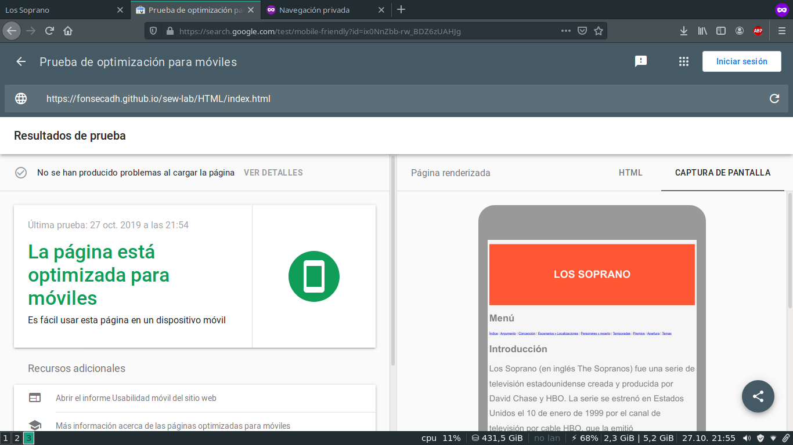{height=350px}

{height=350px}

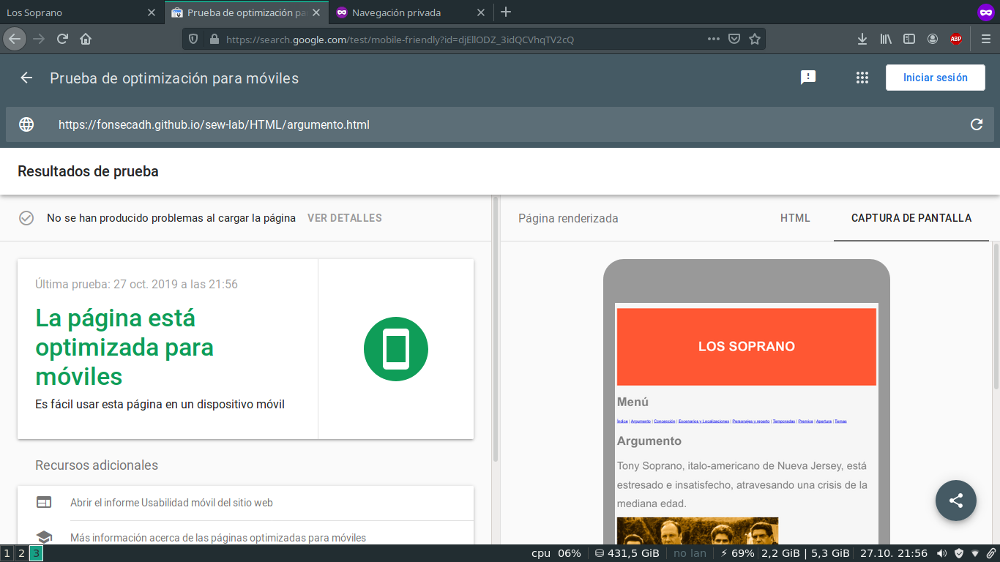{height=350px}

{height=350px}

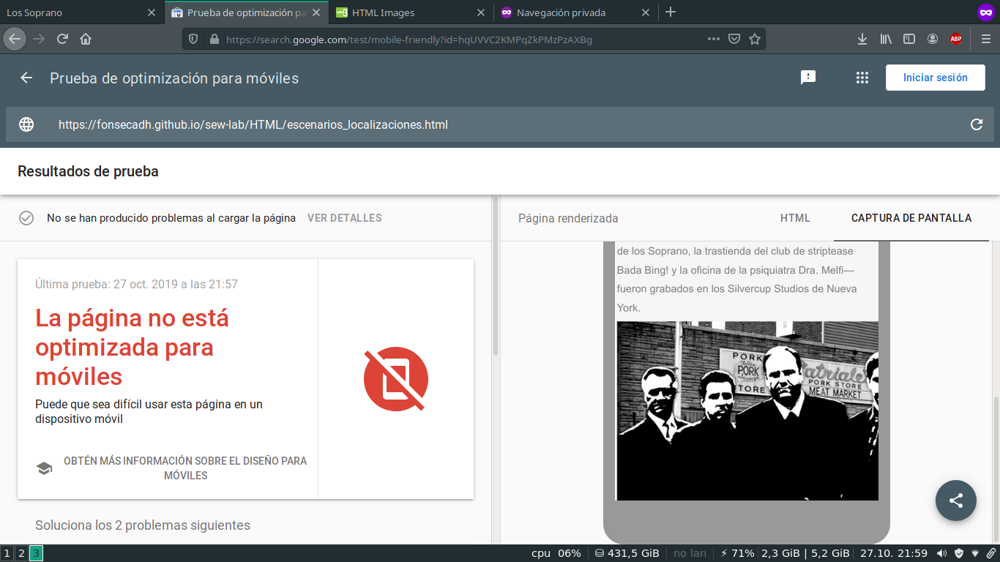{height=350px}

{height=350px}

{height=350px}

{height=350px}

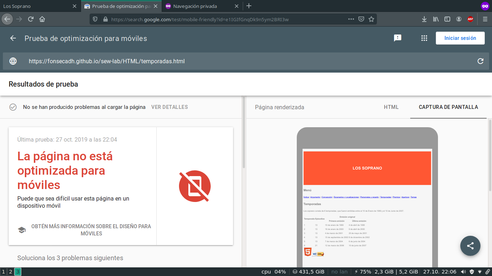{height=350px}

